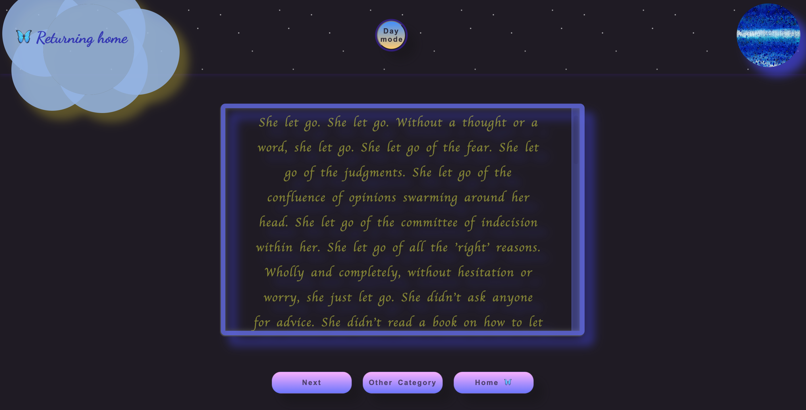

# `Returning Home App`
***

#### [Returning Home App Link](https://returning-home-app.netlify.app)
---
#### `Description`
##### A bootcamp experience inevitably leads us to experience the emotional cycle of change. The combination of facing the "valley of despair" stage whilst the insidious imposter syndrome voice gets louder--all while attempting to learn a completely new language--can make us feel alone in the fog. When faced with doubt, fear, and the strong urge to give up; understanding, support and wisdom can help us embrace and trust the journey. As Buddhist monk Thích Nhất Hạnh says, it is with the breath that we return home to ourselves and the present moment. 

The returning home app offers:

- [x] Eight seconds of deep breathing 
- [x] Wisdom from Stoic philosophy, Buddhism, psychologists, a physician and a poet 
- [x] Support categories: a. Comparison b. Impostor Syndrome c. Acceptance d. Self-Love
- [x] Randomized quotes per category
- [x] Day night mode

---

|   `Technology`     | `Attributions`|    `Icebox Items`          |
|:------------------:|:-------------:|:--------------------------:|
| CSS       |*freesound.org*| sources links|
| HTML               |*favicon.cc*   | CSS element > usage        |
| JavaScript                |*Shannon Crabill - breathing animation*    | CSS display: flex use|
| VS Code                   |*lauryndbrown CSS3 cloud*              |  JS timer function          |
| Netlify                    | *ileriayo badge list*
***

***

##### `Attributions Links`
[GitHub Markdown Cheatsheet](https://github.com/adam-p/markdown-here/wiki/Markdown-Cheatsheet)  
[Pure CSS Chalkboard](https://gist.github.com/craigiswayne/58938f6e7c8492673f97)  
[DirtyMarkup Beautifier](https://www.10bestdesign.com/dirtymarkup/js/)  
[CSS3 Clouds](https://lauryndbrown.github.io/2017/06/08/creating-clouds-in-css.html)  
[CSS Breathing Animation](https://dev.to/scrabill/focused-breathing-a-css-animation-to-help-with-meditation-and-focused-breathing-exercises-dob)  
[Favicon.cc](https://www.favicon.cc/)  
[freesound.org](https://freesound.org/people/klankbeeld/sounds/633954/)  
[coolors.co](https://coolors.co/gradients)  
[markdown-badges](https://github.com/Ileriayo/markdown-badges)

